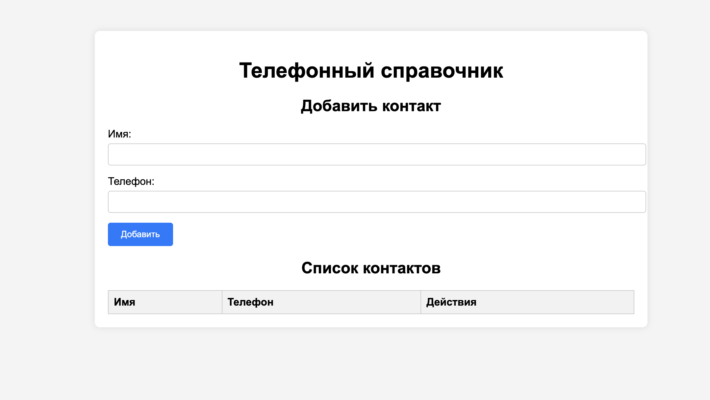
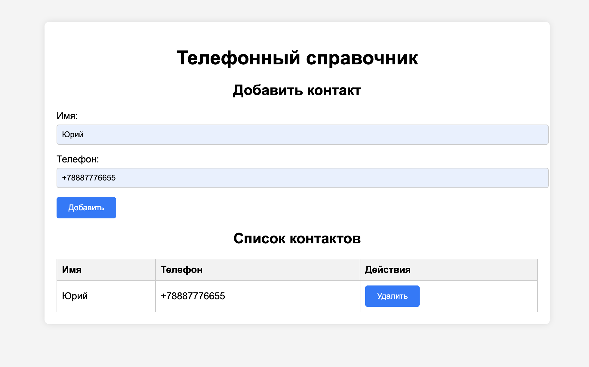
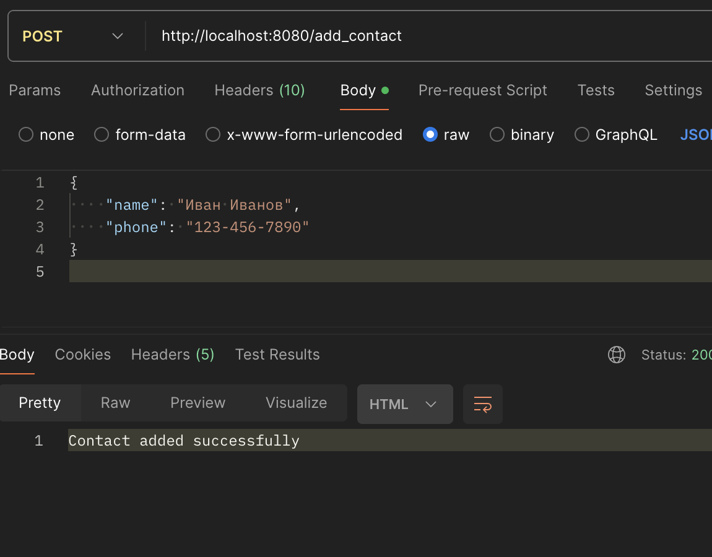
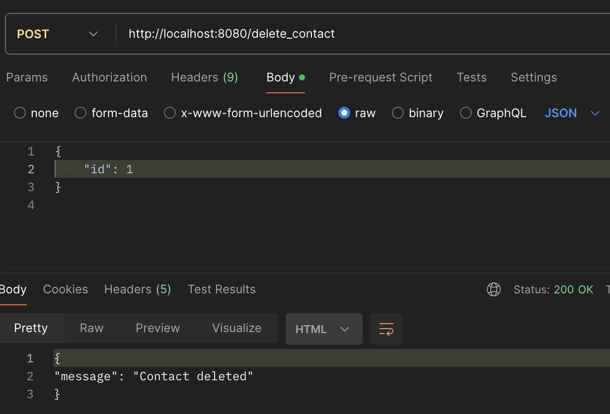

# PhoneBook
Test assignment for Effective Mobile

## Демонстрация работы приложения

https://drive.google.com/file/d/16swANi_3W49sRYGM8IrJd2Von06bBu1V/view?usp=sharing 

## Запуск приложения

В корне проекта выполните команду

```bash
make
```

Перейдите по ссылке [localhost:8080](http://localhost:8080) в браузере



Введите данные контакты и нажмите добавить



После нажатия на кнопку удалить контакт пропадет. 
Полную работу сервиса можно посмотреть на видео по ссылке выше.

## API

Работать с приложением можно и без визуальной части. Достаточной отправлять запросы к API.

/get_contacts - получить список контактов (GET запрос).

/add_contact - добавить контакт (POST запрос).
В теле запроса должно быть имя и телефон (в формате JSON).



/delete_contact - удалить контакт (POST запрос).
В теле запроса должно быть id контакта (в формате JSON).

